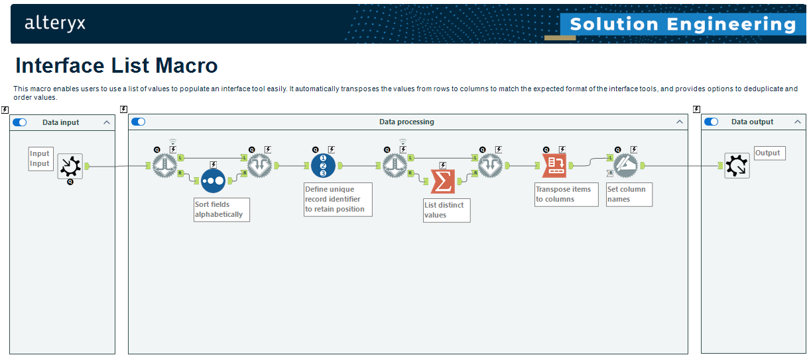
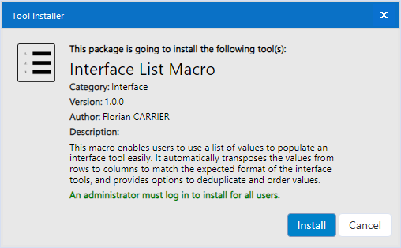
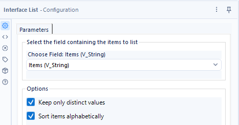
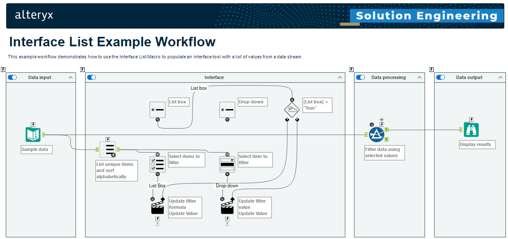

# Alteryx Interface List Macro

The repository provides a macro for [Alteryx Designer Desktop](https://www.alteryx.com/products/alteryx-designer) to enable users to use a list of values to populate an interface tool easily. It automatically transposes the values from rows to columns to match the expected format of the interface tools, and provides options to deduplicate and order values.

## Installation

A standard [Alteryx Tool Installer](https://help.alteryx.com/current/en/server/install/install-custom-tools.html) (.YXI) file is provided. Upon executing the installer, the macro will be setup on the local machine and made available in Alteryx Designer Desktop under the "Interface" tool category.

## Usage

### Configuration

The macro requires a single input and provides three configuraiton options:

1. Mandatory:
   1. Items to list: The field from the input data to be used as items in the list.
2. Optional:
   1. Keep only distinct values: When checked, only distinct values from the selected field will be included in the list.
   2. Sort items alphabetically: When checked, the items in the list will be sorted in ascending alphabetical order.

### Example

Upon installation, an example workflow will be made available in Alteryx Designer Desktop under `Help > Sample Workflows > Macros > Interface List Example Workflow`.

## Dependencies

### PSAYX PowerShell module

In order to build the Alteryx Installer (.YXI) using the provided [Build-YXI](Build-YXI.ps1) PowerShell script, the [PSAYX PowerShell module](https://www.powershellgallery.com/packages/PSAYX) is required.
